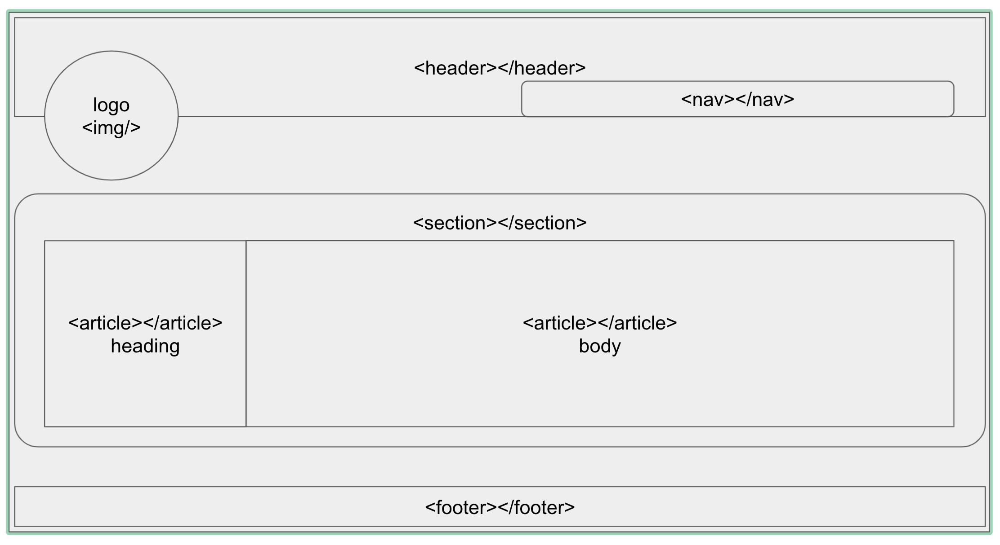

# Gospel Chukwu - Portfolio
## Project Description
This is an oline representation of who I am, what my software engineering skills are and how they can benefit your business when you hire me 🙌🏾

---

## Table of Content
1. [Project Description](https://github.com/Brondchux/hw2-my-portfolio#project-description)
2. [Acceptance Criteria](https://github.com/Brondchux/hw2-my-portfolio#acceptance-criteria)
3. [Wireframe Preview](https://github.com/Brondchux/hw2-my-portfolio#wireframe-preview)
4. [Useful Links](https://github.com/Brondchux/hw2-my-portfolio#useful-links)
5. [Credits](https://github.com/Brondchux/hw2-my-portfolio#credits)
6. [Licence](https://github.com/Brondchux/hw2-my-portfolio#licence)

---
## Acceptance Criteria

Here are the critical requirements necessary to develop a portfolio that satisfies a typical hiring manager’s needs:

```
GIVEN I need to sample a potential employee's previous work
WHEN I load their portfolio
THEN I am presented with the developer's name, a recent photo or avatar, and links to sections about them, their work, and how to contact them
WHEN I click one of the links in the navigation
THEN the UI scrolls to the corresponding section
WHEN I click on the link to the section about their work
THEN the UI scrolls to a section with titled images of the developer's applications
WHEN I am presented with the developer's first application
THEN that application's image should be larger in size than the others
WHEN I click on the images of the applications
THEN I am taken to that deployed application
WHEN I resize the page or view the site on various screens and devices
THEN I am presented with a responsive layout that adapts to my viewport
```

## Wireframe Preview

The image below shows the wireframe of what my portfolio should look like when completed:



---
## Useful Links
1. [Click me to view the github repository for this project](https://github.com/Brondchux/hw2-my-portfolio)
2. [Click me to view the deployed application via github pages](https://brondchux.github.io/hw2-my-portfolio/)

## Credits
Appreciations to Ben 🙌🏾 of [Columbia University Coding Bootcamp](https://bootcamp.cvn.columbia.edu/coding/landing-ftpt/?s=Google-Brand&msg_cv_scta=4&msg_cv_stbn=1&msg_cv_fcta=1&dki=Learn%20Coding&pkw=%2Bcolumbia%20%2Bcoding%20%2Bbootcamp&pcrid=471112563836&pmt=b&utm_source=google&utm_medium=cpc&utm_campaign=GGL%7CCOLUMBIA-UNIVERSITY%7CSEM%7CCODING%7C-%7COFL%7CTIER-1%7CALL%7CBRD%7CBMM%7CCore%7CBootcamp&utm_term=%2Bcolumbia%20%2Bcoding%20%2Bbootcamp&s=google&k=%2Bcolumbia%20%2Bcoding%20%2Bbootcamp&utm_adgroupid=111600049635&utm_locationphysicalms=9067609&utm_matchtype=b&utm_network=g&utm_device=c&utm_content=471112563836&utm_placement=&gclid=CjwKCAjwlrqHBhByEiwAnLmYUA8CIItksRJF6IT6XMX8WOOJBO-jtCRkzXZhI2gvsZrFEpYdRXy54RoC6jQQAvD_BwE&gclsrc=aw.ds) for being our tutor in this bootcamp.

Shoutout to my team for the study group outside class hours, it went a long way in making this happen. 👍🏾

Special thanks to [Google](https://www.google.com) for helping me find the accurate answers to my questions in a very timely manner.

Thanks to [Markdown Cheatsheet](https://github.com/adam-p/markdown-here/wiki/Markdown-Cheatsheet) for quick and easy markdown documentation.

Thanks to [SETCorrect LLC](https://www.setcorrect.com/portfolio/work11/) for guides on how to anchor-link on markdown files.

## Licence
Coming soon!